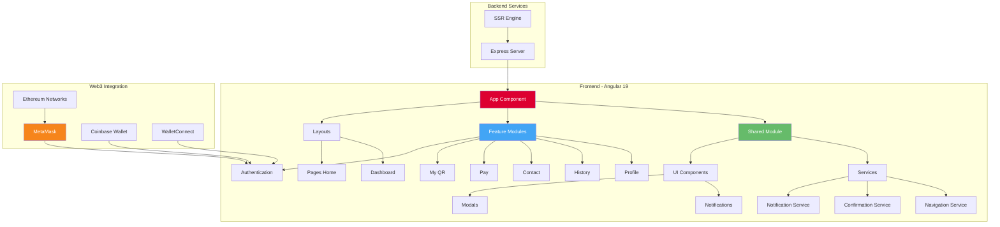
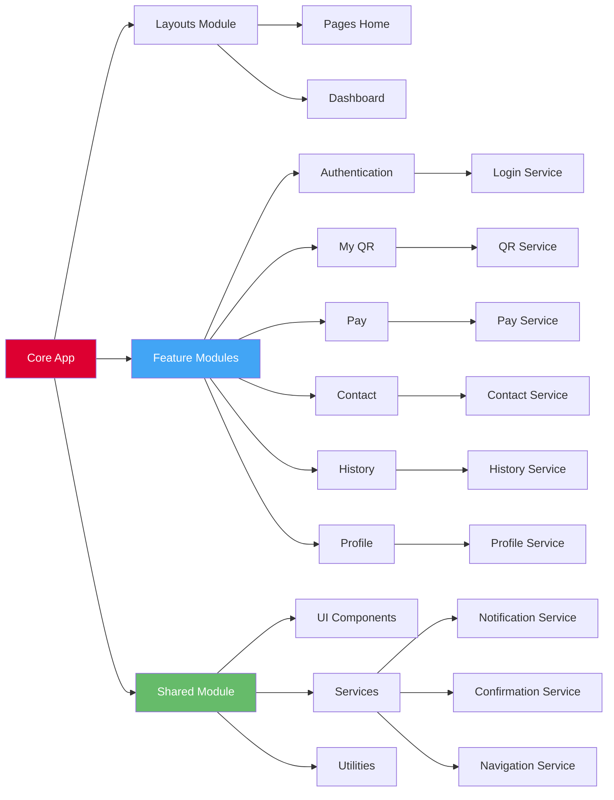
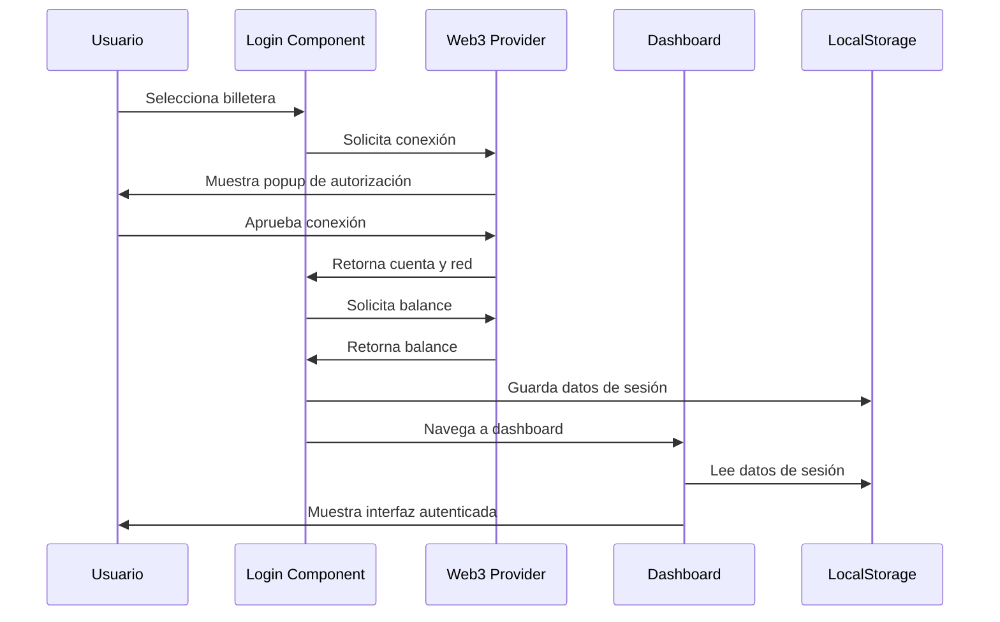

<div align="center">

# 🌾 RuralPay - CryptoPay

### Sistema de Pagos Rurales con Blockchain

[](https://angular.io/)
[](https://www.typescriptlang.org/)
[](https://tailwindcss.com/)
[](https://nodejs.org/)
[](https://www.docker.com/)

</div>

---

## 📋 Tabla de Contenidos

- [Descripción](#-descripción)
- [Características](#-características)
- [Arquitectura](#-arquitectura)
- [Tecnologías](#-tecnologías)
- [Requisitos Previos](#-requisitos-previos)
- [Instalación](#-instalación)
- [Uso](#-uso)
- [Estructura del Proyecto](#-estructura-del-proyecto)
- [Módulos](#-módulos)
- [Rutas](#-rutas)
- [Docker](#-docker)
- [Scripts Disponibles](#-scripts-disponibles)
- [Testing](#-testing)
- [Contribución](#-contribución)

---

## 📖 Descripción

**RuralPay** es una aplicación web moderna de pagos basada en blockchain, diseñada específicamente para facilitar transacciones financieras en zonas rurales. La plataforma integra tecnología de criptomonedas con una interfaz intuitiva, permitiendo a usuarios en áreas con acceso limitado a servicios bancarios tradicionales realizar pagos seguros mediante códigos QR y billeteras digitales.

### 🎯 Objetivo Principal

Democratizar el acceso a servicios financieros digitales en comunidades rurales mediante tecnología blockchain, proporcionando una solución de pago descentralizada, segura y fácil de usar.

---

## ✨ Características

### 🔐 Autenticación Web3
- Conexión con **MetaMask**, **Coinbase Wallet** y **WalletConnect**
- Soporte multi-red (Ethereum, Polygon, BSC, testnets)
- Gestión automática de cambios de cuenta y red
- Redes personalizadas configurables

### 💳 Gestión de Pagos
- **Generación de códigos QR** para recibir pagos
- **Escaneo de QR** para realizar pagos
- Visualización de balance en tiempo real
- Conversión automática a USD
- Historial completo de transacciones

### 👤 Perfil de Usuario
- Gestión de información personal
- Imagen de perfil personalizable
- Visualización de dirección de billetera
- Configuración de preferencias

### 📱 Interfaz Responsiva
- Diseño mobile-first con TailwindCSS
- Menú lateral adaptativo
- Notificaciones toast personalizadas
- Modales de confirmación elegantes

### 🌐 Server-Side Rendering (SSR)
- Renderizado del lado del servidor con Angular Universal
- Mejor SEO y rendimiento inicial
- Soporte para Express.js

---

## 🏗️ Arquitectura

### Diagrama de Arquitectura General



### Arquitectura de Módulos



### Flujo de Autenticación



---

## 🛠️ Tecnologías

### Frontend Framework
-  **Angular 19.2.0** - Framework principal
-  **TypeScript 5.7.2** - Lenguaje de programación
-  **RxJS 7.8.0** - Programación reactiva

### Estilos y UI
-  **TailwindCSS 3.4.15** - Framework CSS utility-first
-  **CSS3** - Estilos personalizados

### Backend y SSR
-  **Node.js 20** - Runtime de JavaScript
-  **Express 4.18.2** - Servidor web
- **Angular Universal** - Server-Side Rendering

### Blockchain y Web3
- **MetaMask** - Billetera de criptomonedas
- **Web3 Provider** - Interacción con blockchain
- **Ethereum Networks** - Mainnet y testnets

### Utilidades
-  **qrcode 1.5.4** - Generación de códigos QR
- **Zone.js** - Detección de cambios

### Testing
-  **Jasmine 5.6.0** - Framework de testing
-  **Karma 6.4.0** - Test runner

### DevOps
-  **Docker** - Containerización
-  **Nginx** - Servidor web de producción

---

## 📦 Requisitos Previos

Antes de comenzar, asegúrate de tener instalado:

- **Node.js** >= 20.x
- **npm** >= 10.x
- **Angular CLI** >= 19.x
- **Git**
- **MetaMask** (extensión del navegador) - Opcional para desarrollo
- **Docker** y **Docker Compose** - Opcional para deployment

### Instalación de Angular CLI

```bash
npm install -g @angular/cli@19
```

---

## 🚀 Instalación

### 1. Clonar el Repositorio

```bash
git clone https://github.com/tu-usuario/rural-pay.git
cd rural-pay
```

### 2. Instalar Dependencias

```bash
npm install
```

### 3. Configuración del Entorno

El proyecto está configurado para funcionar con múltiples redes blockchain. No se requiere configuración adicional para desarrollo local.

---

## 💻 Uso

### Servidor de Desarrollo

Inicia el servidor de desarrollo en `http://localhost:4200/`:

```bash
npm start
# o
ng serve
```

La aplicación se recargará automáticamente cuando modifiques los archivos fuente.

### Build de Producción

Compila el proyecto para producción:

```bash
npm run build
```

Los archivos compilados se guardarán en el directorio `dist/`.

### Servidor SSR

Para ejecutar la aplicación con Server-Side Rendering:

```bash
# 1. Build SSR
ng build --configuration production

# 2. Iniciar servidor
npm run serve:ssr:RuralPay
```

---

## 📁 Estructura del Proyecto

```
rural-pay/
├── 📂 .angular/                    # Cache de Angular
├── 📂 .git/                        # Control de versiones
├── 📂 .vscode/                     # Configuración de VS Code
├── 📂 node_modules/                # Dependencias
├── 📂 public/                      # Recursos públicos
│   ├── favicon.ico
│   └── ruralpay.png
├── 📂 src/                         # Código fuente
│   ├── 📂 app/                     # Aplicación Angular
│   │   ├── 📂 layouts/             # Componentes de layout
│   │   │   └── 📂 components/
│   │   │       ├── 📂 dashboard/   # Layout del dashboard
│   │   │       └── 📂 pages-home/  # Layout de página principal
│   │   ├── 📂 modules/             # Módulos de características
│   │   │   ├── 📂 authentication/  # 🔐 Módulo de autenticación
│   │   │   │   ├── 📂 components/
│   │   │   │   │   └── 📂 login/
│   │   │   │   └── 📂 services/
│   │   │   ├── 📂 contact/         # 📞 Módulo de contacto
│   │   │   │   ├── 📂 components/
│   │   │   │   └── 📂 services/
│   │   │   ├── 📂 history/         # 📜 Módulo de historial
│   │   │   │   ├── 📂 components/
│   │   │   │   └── 📂 services/
│   │   │   ├── 📂 my-qr/           # 📱 Módulo de QR personal
│   │   │   │   ├── 📂 components/
│   │   │   │   └── 📂 services/
│   │   │   ├── 📂 pay/             # 💳 Módulo de pagos
│   │   │   │   ├── 📂 components/
│   │   │   │   └── 📂 services/
│   │   │   └── 📂 profile/         # 👤 Módulo de perfil
│   │   │       ├── 📂 components/
│   │   │       └── 📂 services/
│   │   ├── 📂 shared/              # Componentes y servicios compartidos
│   │   │   ├── 📂 components/
│   │   │   │   └── 📂 ui/
│   │   │   │       ├── 📂 modals/
│   │   │   │       │   ├── 📂 base-modal/
│   │   │   │       │   └── 📂 confirmation-modal/
│   │   │   │       └── 📂 notifications/
│   │   │   │           ├── 📂 alert/
│   │   │   │           ├── 📂 confirmation/
│   │   │   │           ├── 📂 confirmation-dialog/
│   │   │   │           └── 📂 toast/
│   │   │   ├── 📂 services/
│   │   │   │   ├── confirmation.service.ts
│   │   │   │   ├── navigation.service.ts
│   │   │   │   └── notification.service.ts
│   │   │   └── index.ts
│   │   ├── app.component.ts        # Componente raíz
│   │   ├── app.config.ts           # Configuración de la app
│   │   ├── app.routes.ts           # Definición de rutas
│   │   └── app.routes.server.ts    # Rutas SSR
│   ├── index.html                  # HTML principal
│   ├── main.ts                     # Punto de entrada
│   ├── main.server.ts              # Punto de entrada SSR
│   ├── server.ts                   # Servidor Express
│   └── styles.css                  # Estilos globales
├── 📄 .editorconfig                # Configuración del editor
├── 📄 .gitignore                   # Archivos ignorados por Git
├── 📄 angular.json                 # Configuración de Angular
├── 📄 Dockerfile                   # Configuración de Docker
├── 📄 docker-compose.yml           # Orquestación de contenedores
├── 📄 package.json                 # Dependencias del proyecto
├── 📄 postcss.config.js            # Configuración de PostCSS
├── 📄 README.md                    # Este archivo
├── 📄 tailwind.config.js           # Configuración de Tailwind
├── 📄 tsconfig.json                # Configuración de TypeScript
├── 📄 tsconfig.app.json            # Config TS para la app
└── 📄 tsconfig.spec.json           # Config TS para tests
```

---

## 🧩 Módulos

### 🔐 Authentication Module
**Responsabilidad:** Gestión de autenticación con billeteras Web3

**Componentes:**
- `LoginComponent` - Interfaz de conexión de billeteras

**Servicios:**
- `LoginService` - Lógica de autenticación

**Características:**
- Conexión con MetaMask, Coinbase Wallet, WalletConnect
- Selección de redes blockchain
- Gestión de sesión con localStorage

---

### 📱 My QR Module
**Responsabilidad:** Generación y gestión de códigos QR personales

**Componentes:**
- `MyQrComponent` - Visualización y generación de QR

**Servicios:**
- `MyQrService` - Lógica de generación de QR

**Características:**
- Generación de QR con dirección de billetera
- Descarga de código QR
- Compartir código QR

---

### 💳 Pay Module
**Responsabilidad:** Procesamiento de pagos mediante QR

**Componentes:**
- `PayComponent` - Interfaz de pago

**Servicios:**
- `PayService` - Lógica de transacciones

**Características:**
- Escaneo de códigos QR
- Confirmación de transacciones
- Integración con Web3

---

### 📜 History Module
**Responsabilidad:** Visualización del historial de transacciones

**Componentes:**
- `HistoryComponent` - Lista de transacciones

**Servicios:**
- `HistoryService` - Gestión de historial

**Características:**
- Listado de transacciones enviadas y recibidas
- Filtros y búsqueda
- Detalles de transacción

---

### 👤 Profile Module
**Responsabilidad:** Gestión del perfil de usuario

**Componentes:**
- `ProfileComponent` - Edición de perfil

**Servicios:**
- `ProfileService` - Gestión de datos de usuario

**Características:**
- Edición de información personal
- Carga de imagen de perfil
- Visualización de dirección de billetera

---

### 📞 Contact Module
**Responsabilidad:** Gestión de contactos y soporte

**Componentes:**
- `ContactComponent` - Formulario de contacto

**Servicios:**
- `ContactService` - Envío de mensajes

**Características:**
- Formulario de contacto
- Soporte técnico
- FAQ

---

### 🔧 Shared Module
**Responsabilidad:** Componentes y servicios reutilizables

**Componentes UI:**
- `BaseModalComponent` - Modal base reutilizable
- `ConfirmationModalComponent` - Modal de confirmación
- `AlertComponent` - Alertas
- `ToastComponent` - Notificaciones toast
- `ConfirmationDialogComponent` - Diálogos de confirmación

**Servicios:**
- `NotificationService` - Sistema de notificaciones
- `ConfirmationService` - Diálogos de confirmación
- `NavigationService` - Gestión de navegación

---

## 🛣️ Rutas

| Ruta | Componente | Descripción | Acceso |
|------|-----------|-------------|--------|
| `/` | `PagesHomeComponent` | Página de inicio | Público |
| `/login` | `LoginComponent` | Autenticación con billetera | Público |
| `/dashboard` | `DashboardComponent` | Panel principal | Autenticado |
| `/my-qr` | `MyQrComponent` | Código QR personal | Autenticado |
| `/pay` | `PayComponent` | Realizar pagos | Autenticado |
| `/contact` | `ContactComponent` | Contacto y soporte | Público |
| `/history` | `HistoryComponent` | Historial de transacciones | Autenticado |
| `/profile` | `ProfileComponent` | Perfil de usuario | Autenticado |
| `/**` | Redirect a `/` | Ruta no encontrada | - |

---

## 🐳 Docker

### Build de la Imagen

```bash
docker build -t rural-pay:latest .
```

### Ejecutar con Docker Compose

```bash
docker-compose up -d
```

La aplicación estará disponible en:
- **Puerto 80:** Aplicación principal
- **Puerto 8080:** Nginx proxy

### Detener Contenedores

```bash
docker-compose down
```

### Ver Logs

```bash
docker-compose logs -f rural-pay
```

---

## 📜 Scripts Disponibles

| Script | Comando | Descripción |
|--------|---------|-------------|
| **start** | `npm start` | Inicia servidor de desarrollo |
| **build** | `npm run build` | Build de producción |
| **watch** | `npm run watch` | Build en modo watch |
| **test** | `npm test` | Ejecuta tests unitarios |
| **serve:ssr** | `npm run serve:ssr:RuralPay` | Inicia servidor SSR |

---

## 🧪 Testing

### Ejecutar Tests Unitarios

```bash
npm test
```

Los tests se ejecutan con **Karma** y **Jasmine**.

### Estructura de Tests

Cada componente y servicio tiene su archivo de test correspondiente:

```
component-name/
├── component-name.component.ts
├── component-name.component.html
├── component-name.component.css
└── component-name.component.spec.ts  ← Archivo de test
```

### Ejemplo de Test

```typescript
describe('LoginComponent', () => {
  let component: LoginComponent;
  let fixture: ComponentFixture<LoginComponent>;

  beforeEach(async () => {
    await TestBed.configureTestingModule({
      imports: [LoginComponent]
    }).compileComponents();

    fixture = TestBed.createComponent(LoginComponent);
    component = fixture.componentInstance;
    fixture.detectChanges();
  });

  it('should create', () => {
    expect(component).toBeTruthy();
  });
});
```

---

## 🤝 Contribución

Las contribuciones son bienvenidas. Por favor, sigue estos pasos:

1. **Fork** el proyecto
2. Crea una **rama** para tu feature (`git checkout -b feature/AmazingFeature`)
3. **Commit** tus cambios (`git commit -m 'Add some AmazingFeature'`)
4. **Push** a la rama (`git push origin feature/AmazingFeature`)
5. Abre un **Pull Request**

### Convenciones de Código

- Usa **TypeScript** estricto
- Sigue las guías de estilo de **Angular**
- Escribe **tests** para nuevas funcionalidades
- Documenta funciones y componentes complejos
- Usa **commits semánticos**

---

## 👥 Equipo de Desarrollo(a) RuralPay

*Desarrollador(a):* Maria Lazaro
- *Email:* maria.lazaro@vallegrande.edu.pe

*Desarrollador(a):* Johan Malasquez
- *Email:* johan.malasquez@vallegrande.edu.pe

*Desarrollador:* Santiago Prada Lazaro
- *Email:* santiago.prada@vallegrande.edu.pe

---

## 🙏 Agradecimientos

- Angular Team por el excelente framework
- Comunidad de TailwindCSS
- MetaMask por la integración Web3
- Todos los contribuidores del proyecto

---

<div align="center">

**📄 Licencia**

Este proyecto es privado y está protegido por derechos de autor.

---

**Realizado por Desarrolador(a) Blockchain para comunidades rurales**

[](https://angular.io/)
[](https://www.typescriptlang.org/)

</div>
